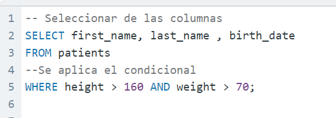
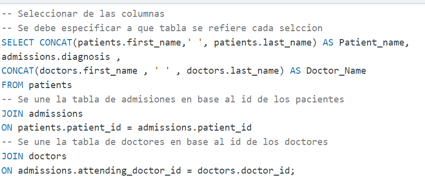

# LABORATORIO 8 

En el presente laboratorio se practicó el uso de SQL para el manejo de bases de datos relacionales. Para ello se utilizarón dos bases de datos:
- **hospital.db**: Base de datos que lleva un registro de las admisiones, doctores y provincias los cuales son datos que poseen los pacientes en el hospital. 
-  **northwind.db**: Base de datos que contiene las tablas de lo que parece ser una empresa distribuidora. Relaciona los clientes con sus ordenes y además contiene otros aspectos de la empresa como los datos de los provedores. 

| **Base de datos** 	| **Columna** 	| **Relaciones** 	|
|---	|---	|---	|
| Northwind.db 	| products 	| clave foranea 1 a más en order details 	|
| Northwind.db 	| order_details 	|  	|
| Northwind.db 	| supliers 	| clave foranea 1 a más en productos 	|
| Northwind.db 	| categories 	| clave foranea 1 a más en prodcutos 	|
| Northwind.db 	| orders 	| clave foranea 1 a más en order_details 	|
| Northwind.db 	| shippers 	| clave foranea 1 a más en ship_via 	|
| Northwind.db 	| territories 	| clave foranea 1 a más en employees_territories 	|
| Northwind.db 	| employees 	| clave foranea 1 a más en employees_territories 	|
| Northwind.db 	| employess_territories 	|  	|
| Northwind.db 	| regions 	| clave foranea 1 a más en territories 	|
| Northwind.db 	| customers 	| clave foranea 1 a más en orders 	|
| hospital.db 	| patients 	| clave foranea 1 a más en admissions 	|
|  hospital.db 	| doctors 	|  	|
|  hospital.db 	| admissions 	|  	|
|  hospital.db 	| provience_names 	| clave foranea 1 a más en patients 	|

## Grupo 1

| **Integrante** 	| **Ejercicios** 	|
|---	|---	|
| Mariana Solís González 	| 1-4 	|
| Esteban Aragón Herrera 	| 5-8 	|
| Kevin Campos Castro 	| 9-12 	|
| Susan Morales 	| 13-16 	|

## Preguntas 

### Hospital.db
1. (Fácil) Write a query to find the first_name, last name and birth date of patients who has height greater than 160 and weight greater than 70


2. (Medio) For every admission, display the patient's full name, their admission diagnosis, and their doctor's full name who diagnosed their problem.



3. (Medio) Display the first name, last name and number of duplicate patients based on their first name and last name.
Ex: A patient with an identical name can be considered a duplicate.


4. (Difícil) Show all of the patients grouped into weight groups.
Show the total amount of patients in each weight group.
Order the list by the weight group decending.
For example, if they weight 100 to 109 they are placed in the 100 weight group, 110-119 = 110 weight group,etc.


5. (Facil) Write a query to find list of patients first_name, last_name, and allergies where allergies are not null and are from the city of 'Hamilton'
    ```
    SELECT first_name, last_name, allergies
    FROM patients
    where 
        allergies is not null
        and city = 'Hamilton'
    ```
6. (Medio) Show patient_id, first_name, last_name from patients whose does not have any records in the admissions table. (Their patient_id does not exist in any admissions.patient_id rows.)
    ```
    SELECT patients.patient_id, patients.first_name, patients.last_name 
    FROM patients
    where patients.patient_id not in (
    select admissions.patient_id
    from admissions)
    ```
7. (Medio) Display patient's full name,
height in the units feet rounded to 1 decimal,
weight in the unit pounds rounded to 0 decimals,
birth_date,
gender non abbreviated.
Convert CM to feet by dividing by 30.48.
Convert KG to pounds by multiplying by 2.205.
    ```
    SELECT
        concat(first_name, ' ', last_name) AS 'patient_name', 
        ROUND(height / 30.48, 1) as 'height "Feet"', 
        ROUND(weight * 2.205, 0) AS 'weight "Pounds"', birth_date,
    CASE
        WHEN gender = 'M' THEN 'MALE' 
    ELSE 'FEMALE' 
    END AS 'gender_type'
    from patients
    ```
8. (Difícil) We need a breakdown for the total amount of admissions each doctor has started each year. Show the doctor_id, doctor_full_name, specialty, year, total_admissions for that year.
    ```
    SELECT
    d.doctor_id as doctor_id,
    CONCAT(d.first_name,' ', d.last_name) as doctor_name,
    d.specialty,
    YEAR(a.admission_date) as selected_year,
    COUNT(*) as total_admissions
    FROM doctors as d
    LEFT JOIN admissions as a ON d.doctor_id = a.attending_doctor_id
    GROUP BY
    doctor_name,
    selected_year
    ORDER BY doctor_id, selected_year
    ```


### Northwind.db
9. (Fácil) Show the category_name and the average product unit price for each category rounded to 2 decimal places.

10. (Medio) Show the first_name, last_name. hire_date of the most recently hired employee.


11. (Medio) Show the city, company_name, contact_name from the customers and suppliers table merged together.

12. (Dificil) Show how much money the company lost due to giving discounts each year, order the years from most recent to least recent. Round to 2 decimal places.

13. (Fácil) Show the category_name and description from the categories table sorted by category_name.

14. (Medio) Show all the contact_name, address, city of all customers which are not from 'Germany' , 'Mexico' , 'Spain'

15. (Medio) Show the category_name and the average product unit price for each category rounded to 2 decimal places.

16. (Difícil) Show the employee's first_name and last_name, a "num_orders" column with a count of the orders taken, and a column called "Shipped" that displays "On Time" if the order shipped_date is less or equal to the required_date, "Late" if the order shipped late.
Order by employee last_name, then by first_name, and then descending by number of orders.


