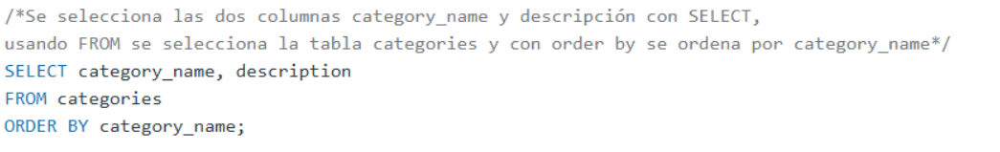

# LABORATORIO 8 

En el presente laboratorio se practicó el uso de SQL para el manejo de bases de datos relacionales. Para ello se utilizarón dos bases de datos:
- **hospital.db**: Base de datos que lleva un registro de las admisiones, doctores y provincias los cuales son datos que poseen los pacientes en el hospital. 
-  **

## Grupo 1

## Preguntas 

### Hospital.db
1. Write a query to find the first_name, last name and birth date of patients who has height greater than 160 and weight greater than 70

    

2. For every admission, display the patient's full name, their admission diagnosis, and their doctor's full name who diagnosed their problem.
    
    - Resultado
    

3.  display the first name, last name and number of duplicate patients based on their first name and last name.
Ex: A patient with an identical name can be considered a duplicate.
    

- Resultado 
    

4. Show all of the patients grouped into weight groups.
Show the total amount of patients in each weight group.
Order the list by the weight group decending.
For example, if they weight 100 to 109 they are placed in the 100 weight group, 110-119 = 110 weight group, etc.

- Resultado

5. 
6.
7. 
8. 

## Northwind
9. Show the category_name and the average product unit price for each category rounded to 2 decimal places.

10. Show the first_name, last_name. hire_date of the most recently hired employee.

11. Show the city, company_name, contact_name from the customers and suppliers table merged together.

12. Show how much money the company lost due to giving discounts each year, order the years from most recent to least recent. Round to 2 decimal places.

13. Show the category_name and description from the categories table sorted by category_name.

14. 
15. Show the category_name and the average product unit price for each category rounded to 2 decimal places.
