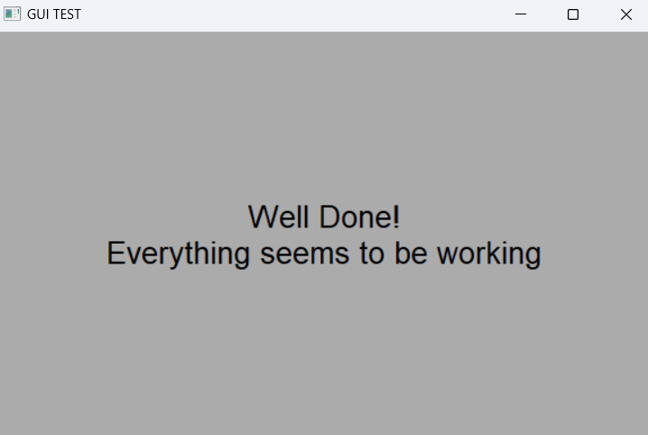
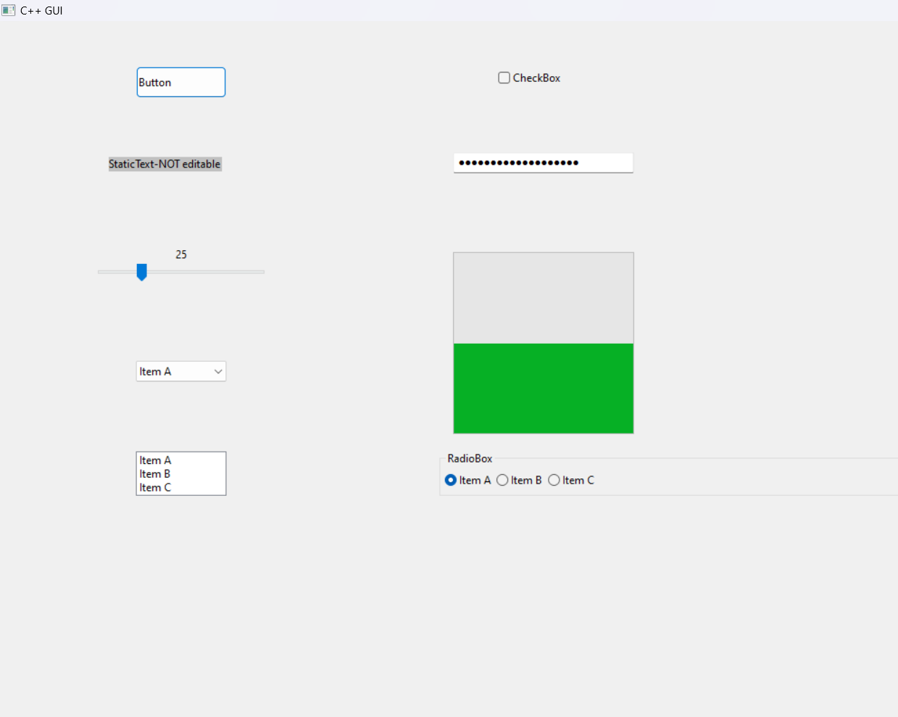
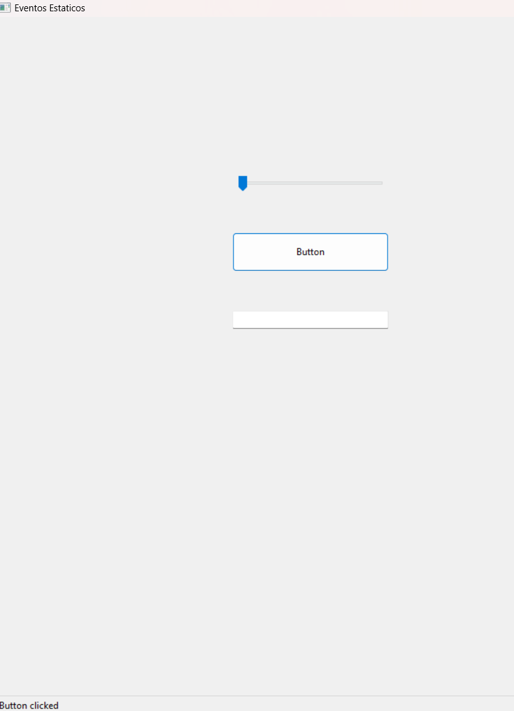
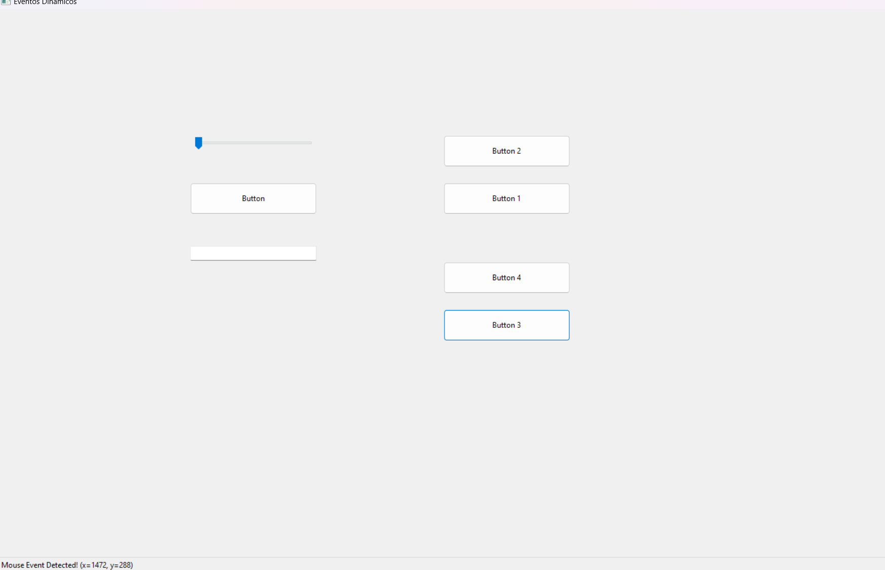

# PREVIO 10
El presente previo exploró la biblioteca _wxWidgets_ para la creación de interfacez gráficas que permitan al usuario una mejor interacción con los programas. Además, se utilizó Visual Studio para realizar la compilación desde el código fuente de la biblioteca.
Se aprendio los conceptos básicos de creación de aplicaciones y el manejo de eventos.
## Ejecución
El previo se encuentra divido en 4 soluciones que distribuyen los códigos de la presentación de la siguiente manera: 
| **_.sln_** 	| **_Contenido_** 	|
|---	|---	|
| wxTest.sln 	| Prueba Inicial 	|
| Creando_una_Ventana_Basica.sln 	| Ejemplo de como iniciar una ventana básica.  Manejo de controles y estilos. 	|
| Eventos.sln 	| Manejo estático de eventos 	|
| Eventos_Dinamicos.sln 	| Ejemplos de cómo realizar el manejo de eventos dinámicos. Se crearón diferentes panels para mostrar los diferentes ejemplos. 	|

En caso que se presenten problemas cargando los .sln ,debido a que por errores subiendo a git no se agregaron los archivos en los directorios .vs y x64, se adjuntan imagenes de prueba de casa .sln.

**Prueba Inicial**

**Creando una Ventana Básica**

**Eventos**

**Eventos_dinamicos**

